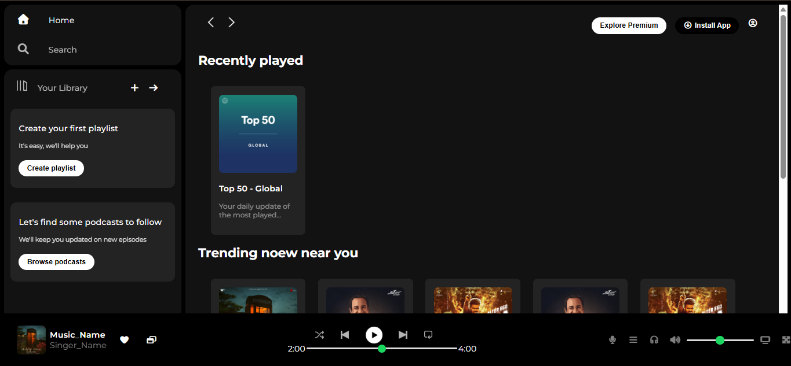

# 🎵 Spotify Web Player Clone

A pixel-faithful recreation of the Spotify web player home page, built purely with **HTML** and **CSS** — no frameworks, no JavaScript.


---

## 📌 About the Project

This is a front-end mini project that replicates the core UI of Spotify's web player. It was built as a CSS practice exercise, focusing on layout, positioning, and responsive design techniques.

---

## ✨ Features

- **Sidebar** with navigation links and a library section
- **Main content area** with scrollable music cards grouped by category (Recently Played, Trending, Featured Charts)
- **Sticky top navigation bar** with action buttons
- **Music player bar** fixed to the bottom, including:
    - Album art, song name, and artist display
    - Playback controls
    - Interactive progress bar (range input)
    - Volume slider
- **Responsive behavior** — elements hide gracefully on smaller screens (< 1000px)
- Custom-styled range inputs using `appearance: none` and `::-webkit-slider` pseudo-elements
- Google Fonts (**Montserrat**) and **Font Awesome 7** icons

---

## 🛠️ Built With

| Technology     | Purpose                                       |
| -------------- | --------------------------------------------- |
| HTML5          | Page structure and semantic markup            |
| CSS3           | Styling, layout (Flexbox), and responsiveness |
| Google Fonts   | Montserrat typeface                           |
| Font Awesome 7 | Icons throughout the UI                       |

---

## 📁 Project Structure

```
spotify-clone/
│
├── index.html          # Main HTML file
├── style.css           # All styles
├── README.md           # Project documentation
└── ASSETS/             # Images and icons
    ├── logo.png
    ├── library_icon.png
    ├── backward_icon.png
    ├── forward_icon.png
    ├── player_icon1.png ... player_icon5.png
    ├── card1img.jpeg ... card6img.jpeg
    └── ...
```

---

## 🚀 Getting Started

No dependencies or build tools required. Just clone and open.

```bash
git clone https://github.com/your-username/spotify-clone.git
cd spotify-clone
```

Then open `index.html` in your browser:

```bash
# On macOS
open index.html

# On Linux
xdg-open index.html

# On Windows
start index.html
```

---

## 📸 Screenshots




---

## 📚 What I Learned

- Using **CSS Flexbox** for complex multi-panel layouts
- Creating a **sticky navbar** inside a scrollable container
- Styling native `<input type="range">` elements with `::-webkit-slider-*` pseudo-elements
- Using `position: fixed` for a persistent music player bar
- Managing `overflow`, `z-index`, and `height: 100vh` for a dashboard-style layout

---
